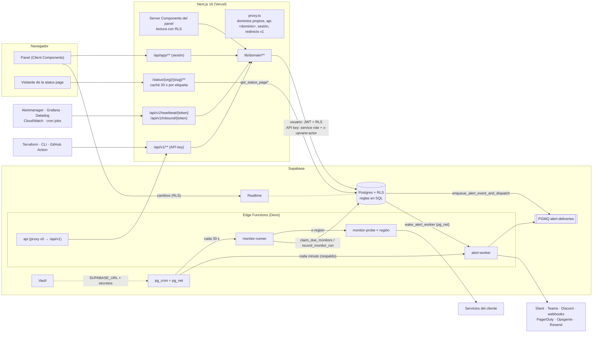
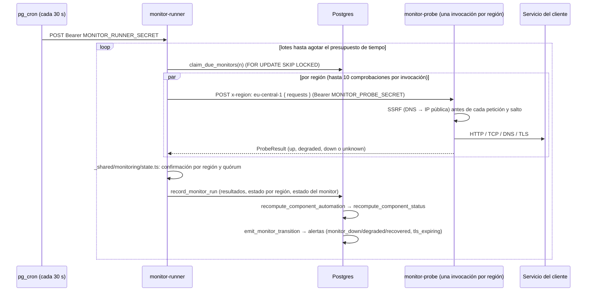
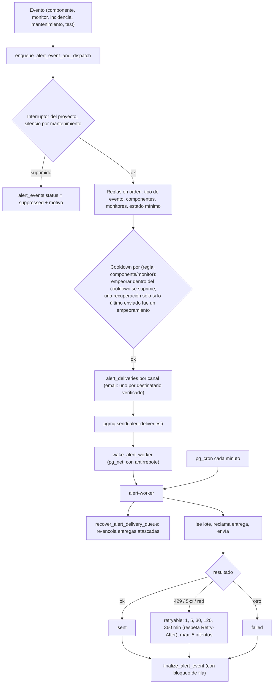

# 02 · Arquitectura

## Mapa del sistema



## Capas del código

| Capa | Dónde | Reglas |
|------|-------|--------|
| Reglas de base de datos | `supabase/migrations/*.sql` | Invariantes de negocio, RLS, límites de plan, cálculo del estado efectivo, enrutado de alertas. Cada cambio es una migración nueva; nunca se edita una aplicada. Tests en `supabase/tests/sql/`. |
| Lógica isomórfica | `supabase/functions/_shared/**` (`@shared/x.ts` desde Next) | TS puro: sin globals de Deno, sin imports npm ni URL, sólo imports relativos `.ts`. La usan Next y las Edge Functions. |
| Dominio | `lib/domain/<área>.ts` + `schemas/<área>.ts` | `server-only`. Cada función recibe un `DomainContext`, llama a `requireProject(ctx, ref, rolMínimo)` (o `requireOrganization`), usa `ctx.db`, lanza `DomainError`, registra `audit()` tras cada mutación e invalida la status page cuando cambia lo público. Devuelve recursos con la forma de la API. |
| API del panel | `app/api/app/**/route.ts` | `appHandler` (`lib/http/app.ts`): sesión + comprobación de mismo origen; cuerpo validado con zod. |
| API pública | `app/api/v1/**/route.ts` | `apiHandler({ scope, idempotent })` (`lib/http/api.ts`): API key, plan, scope, rate limit, `Idempotency-Key`, `X-Request-Id`. Las operaciones se registran en `lib/api/spec/*` y generan la spec OpenAPI. Endpoints con token (heartbeat, inbound) usan `tokenHandler`. |
| Páginas del panel | `app/(panel)/**/page.tsx` | Server Components: `panelContext()` + funciones de dominio dentro de `guard()` (no encontrado → 404). Pasan datos planos a un componente cliente por página. |
| Componentes cliente | `components/panel/<área>/*.tsx` | `appRequest()` dentro de `useAction().run()` (toast + `router.refresh()`), `useConfirm` para acciones destructivas, filtros en la URL. Sin store global. |
| Status page pública | `app/status/[org]/[slug]/**`, `lib/status-page/**`, `components/status/**` | Server Components sin sesión salvo para páginas privadas; caché por etiqueta. |

### Quién habla con la base de datos y con qué permisos

| Origen | Cliente | Rol en Postgres | Protección |
|--------|---------|-----------------|------------|
| Panel (lecturas en Server Components y escrituras en `/api/app`) | `lib/supabase/server.ts` (cookies) | `authenticated` | RLS por pertenencia a la organización (`has_project_role`, `member_project_ids`) + comprobación de rol en `lib/domain/access.ts` |
| API pública con API key | `lib/supabase/admin.ts` con cabecera `x-upvane-actor` | `service_role` actuando como la key | `requireProject` comprueba organización, proyecto y scope; en SQL `request_api_actor()` hace que `is_privileged_session()` sea falso, así que límites de plan y campos gestionados se aplican igual que a una persona |
| Operaciones de sistema (secretos, audit log, invitaciones, cambio de plan) | `ctx.admin()` | `service_role` | Sólo después de una comprobación explícita en el dominio |
| Status page pública | `lib/status-page/data.ts` (cliente anónimo sin cookies) | `anon` | Sólo puede ejecutar las funciones `get_status_page*`, que devuelven campos públicos de páginas públicas |
| Status page privada | Cliente de servicio tras resolver el acceso (miembro, enlace con token o IP permitida) | `service_role` | `resolvePrivateAccess` en `lib/status-page/access.ts` |
| Edge Functions | `createClient(SUPABASE_URL, SERVICE_ROLE_KEY)` | `service_role` | Secreto Bearer propio (`MONITOR_RUNNER_SECRET`, `MONITOR_PROBE_SECRET`, `ALERT_WORKER_SECRET`) |

Todo lo que un navegador puede hacer con la publishable key lo puede hacer un atacante. Por eso las reglas inviolables
viven en RLS, triggers y funciones `security definer`, y el test `17_security_invariants` comprueba que todas las tablas
tienen RLS y que sólo una lista cerrada de funciones privilegiadas es ejecutable por `anon` o `authenticated`.

## Flujos principales

### Estado efectivo de un componente

`components.status` sólo lo escribe `recompute_component_status(component_id, reason, incident_id)`, que aplica esta
prioridad:

1. Incidencias activas y publicadas que incluyen el componente → el peor de sus estados en `incident_components`.
   Durante una incidencia mandan las personas.
2. Mantenimiento `in_progress` que lo incluye → `maintenance`.
3. `manual_status` (fijado a mano hasta "Return to automatic").
4. El peor entre `automated_status` (monitores y señales externas) y el estado derivado de sus dependencias (una
   dependencia en `major_outage` aplica su `impact`, por defecto `partial_outage`; `partial_outage` o `degraded` → `degraded`).
5. `operational`.

Los triggers lo llaman tras cambios en `incident_components`, `incidents.status|deleted_at`, `maintenances.status`,
`maintenance_components`, `components.manual_status|automated_status` y dependencias. Cada cambio deja una fila en
`component_status_history` con el motivo y emite `component_status_worsened` o `component_recovered`.

### Incidencias

```mermaid
sequenceDiagram
  participant P as Panel / API / CLI
  participant D as lib/domain/incidents.ts
  participant DB as Postgres
  P->>D: createIncident(title, impact, components {id: status}, message)
  D->>DB: rpc create_incident (rol responder)
  DB->>DB: incident + incident_components + primera actualización pública
  DB->>DB: recompute_component_status por componente
  DB->>DB: emit_incident_event → alertas al equipo + notificación a suscriptores
  D->>D: audit("incident.created") + invalidar caché de la status page
  P->>D: postIncidentUpdate(status, message, components, visibility)
  D->>DB: rpc post_incident_update
  Note over DB: público: cambia estado y componentes; interno: sólo nota
```

Los borradores (`status = draft`) nunca son públicos ni cambian componentes hasta que se publican. Los crean los
monitores y las integraciones cuando `auto_draft_incident` está activo (evento `incident_draft_created`). Al resolver
una incidencia con impacto ≥ major y `projects.auto_postmortem`, `ensure_postmortem_draft` crea el postmortem.

### Monitores multi-región



- El runner procesa 20 monitores a la vez y agrupa las comprobaciones que una región necesita en el mismo momento en
  una sola invocación de `monitor-probe` (hasta 10, que la sonda ejecuta de 5 en 5). Así el coste en invocaciones es
  del orden de una por región y lote, no una por comprobación.
- Por región, `consecutive_bad ≥ confirm_failures` confirma el último estado malo y `consecutive_up ≥
  recovery_successes` confirma la recuperación. El monitor está `down` si al menos `quorum = min(confirm_regions,
  regiones activas)` regiones confirman caída; `degraded` si el quórum confirma algo malo; si no, `up`. Los errores de
  infraestructura de la sonda (`unknown`) nunca cuentan.
- Monitor → componente: `up → operational`, `degraded → degraded_status`, `down → failure_status`. Un componente con
  varios monitores toma el peor.
- **Heartbeats**: el job del cliente hace `GET|POST /api/v1/heartbeat/{token}` (o `/fail`). `record_heartbeat` lo
  registra y `process_heartbeats()` (cron cada minuto) marca como caídos los que superan `interval + grace`.
- **Run now** (panel y API): `POST …/monitors/{id}/run` llama a `monitor-runner` con `MONITOR_RUNNER_SECRET` y devuelve el
  resultado por región (`maxDuration = 60`).
- En local no hay regiones reales: `monitor-probe` devuelve la región pedida marcada como simulada.

### Señales externas (integraciones)

`POST /api/v1/inbound/{token}` acepta el payload nativo de Alertmanager, Grafana, Datadog, CloudWatch (SNS) o un formato
genérico. `lib/domain/inbound/*` lo traduce a señales, las reglas de mapeo (`label=valor → componente, estado`) eligen el
componente y `ingest_signals` las guarda en `component_signals`. Una señal activa empeora `automated_status`; al
resolverse se borra. Si la integración tiene `auto_draft_incident`, se abre un borrador.

### Alertas



Formatos de entrega (`_shared/alerts/*`): email con plantilla completa (Resend), Slack Block Kit, Teams (Adaptive Card),
Discord (embed), webhook genérico firmado (`Upvane-Signature: t=<ts>,v1=<hmac-sha256(secret, ts + "." + body)>`),
PagerDuty Events v2 (`trigger`/`resolve` con `dedup_key`) y Opsgenie (crear/cerrar por alias, región US o EU).

### Status page pública

1. `proxy.ts` reescribe los dominios propios (`status.cliente.com/...` → `/status/{org}/{slug}/...`) y deja pasar
   `/status/*` sin tocar la sesión del panel.
2. `statusRoute()` (`app/status/[org]/[slug]/_view.ts`) carga la página: `getPublicPayload` usa `unstable_cache` 30 s
   con la etiqueta `status-page:{org}/{slug}`. Las mutaciones del dominio la invalidan al momento; los cambios que hacen
   los monitores dentro de la base de datos se ven, como mucho, 30 s después.
3. Si la página es privada se resuelve el acceso: miembro con sesión, cookie de enlace de acceso
   (`?access_token=spat_…` se canjea una vez por una cookie httpOnly limitada a la página) o IP en `allowed_ips`.
   Sin acceso se muestra la puerta de entrada (`PrivateGate`) con `noindex`.
4. La página es un Server Component; `StatusBootstrap` (script inline) fija tema y zona horaria del visitante antes del
   primer pintado y `LocalTime` formatea con `formatStamp`. `AutoRefresh` recarga cada 30 s si hay incidencia activa y
   cada 120 s si no.
5. Feeds (`feed.rss`, `feed.atom`) y JSON (`api/v2/summary.json`, `api/v2/status.json`, compatible con Statuspage,
   CORS `*` en páginas públicas) se sirven desde la misma caché.

### Suscriptores

- Email: `POST /api/public/status/{org}/{slug}/subscribe` (JSON o formulario sin JS, rate limit 8 cada 10 min por IP y
  página, campo trampa `company`) → `subscribe_to_status_page` guarda el hash del token de confirmación → email con
  enlace → `/subscriptions/confirm` exige un clic (los escáneres de enlaces no confirman).
- Slack (sólo `hooks.slack.com`) y webhook (https público, comprobado contra rangos privados; el secreto de firma se
  muestra una vez): quedan activos al momento, con el destino cifrado.
- Las actualizaciones públicas de incidencias y los avisos de mantenimiento crean eventos con `audience =
  'subscribers'` que van por la misma cola. Los emails llevan `List-Unsubscribe` + `List-Unsubscribe-Post` (RFC 8058);
  el token de baja es `HMAC(UPVANE_SECRETS_KEY, "upvane-unsubscribe:{proyecto}:{clave}")` y se guarda su hash.

### API pública y automatización

`apiHandler` autentica la key (`authenticate_api_key` compara el SHA-256), comprueba plan (Pro o Business), scope y rate
limit (`consume_rate_limit`), reproduce respuestas idempotentes (`api_idempotency_keys`, 24 h) y crea el
`DomainContext` con la key como actor. Las keys de organización ven todos sus proyectos; las de proyecto, sólo uno. La
Edge Function `api` (v0) es un proxy hacia `/api/v1` para que las integraciones antiguas sigan funcionando.

### Tiempo real en el panel

`RealtimeRefresh` se suscribe a cambios de `components`, `incidents`, `incident_updates`, `incident_components` y
`maintenances` del proyecto (RLS aplica) y hace `router.refresh()` con antirrebote. Al volver a una pestaña oculta más
de 30 s también refresca. Los monitores no van por Realtime (cada ejecución toca su fila): sus páginas usan
`AutoRefresh` cada 30 s, y un cambio de estado que afecta a un componente llega por `components`.
