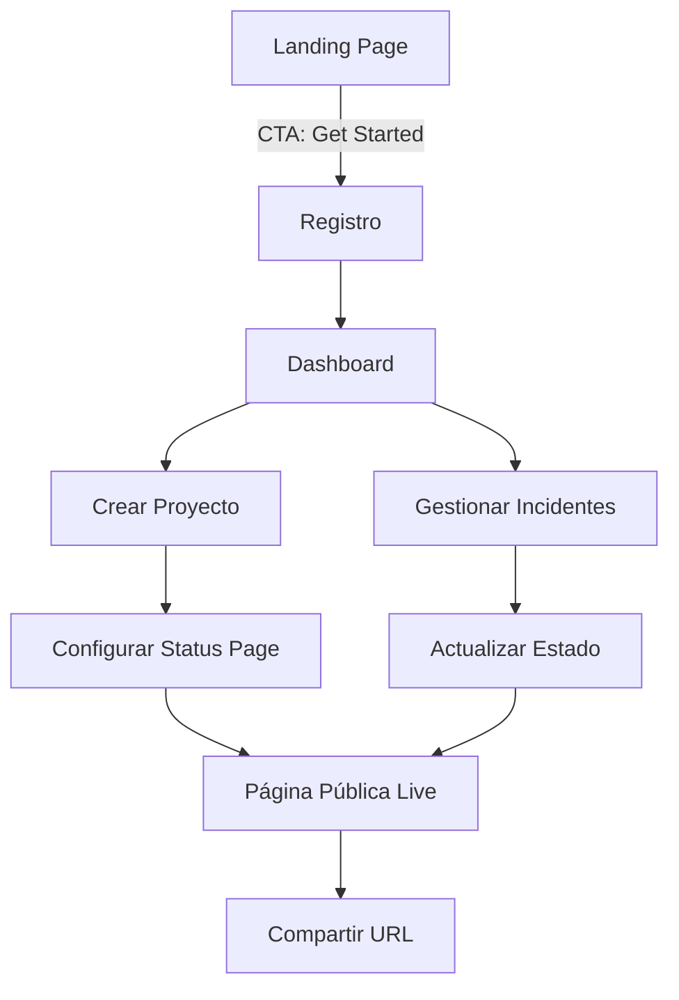

# Upvane — SaaS de Ingresos Pasivos

## Investigación de Mercado (Abril 2026)

### Contexto del Mercado Micro-SaaS
El mercado de micro-SaaS en 2026 favorece productos **verticales**, que resuelven un problema muy específico para un nicho concreto. Las claves del éxito son:
- **Problema cuantificable** → "Pierdo X horas/mes haciendo esto manualmente"
- **Stack moderno y barato** → Vite, Supabase, Stripe → margen >90%
- **Una sola funcionalidad core** ejecutada de forma excepcional
- **Modelo híbrido de pricing** → base mensual + componente de uso

### Nicho Elegido: Status Pages + Landing Pages para Startups/Devs

> [!IMPORTANT]
> **Upvane** — Crea páginas de estado profesionales y landing pages de lanzamiento en segundos. Sin código. Estilo premium.

**¿Por qué este nicho?**
| Factor | Análisis |
|--------|----------|
| **Dolor real** | Devs e indie hackers pierden 4-8h configurando status pages y landing pages para cada proyecto |
| **Competencia fragmentada** | Statuspage.io ($29+/mes, enterprise), BetterStack (complejo), Linktree (no status). No hay producto que combine ambos |
| **Retención natural** | Una status page activa = suscripción indefinida. Churn <3% |
| **SEO orgánico** | "free status page", "landing page builder" → alto volumen de búsqueda |
| **Escalabilidad sin soporte** | Producto self-serve, sin tickets de soporte |

### Competidores Directos
| Producto | Precio | Debilidad |
|----------|--------|-----------|
| Statuspage (Atlassian) | $29-399/mes | Enterprise, sobrecargado, caro |
| BetterStack | $20+/mes | Orientado a DevOps avanzado |
| Instatus | $20+/mes | Solo status pages |
| Linktree/Bio.link | $5-24/mes | Solo links, no estado |

**Nuestra ventaja:** Combinamos status page + landing page minimalista en un solo producto, con diseño premium (estilo Linear), para indie hackers y startups early-stage. Precio accesible con tier gratuito.

---

## Definición del Producto

### Propuesta de Valor
> "Una sola URL para tu proyecto: estado en tiempo real + landing page profesional. Listo en 30 segundos."

### Funcionalidades Core

#### MVP (v1.0 — Lo que construiremos)
1. **Landing Page (Marketing Site)**
   - Hero con propuesta de valor clara
   - Secciones de características
   - Pricing con 3 tiers
   - FAQ
   - Footer con legal

2. **Dashboard de Usuario (App)**
   - Autenticación (email + contraseña)
   - Crear/gestionar proyectos
   - Editor de status page por proyecto
   - Componentes de estado (Operational, Degraded, Down, Maintenance)
   - Historial de incidentes
   - Página pública por proyecto con subdomain style (`proyecto.upvane.com` simulado via routing)
   - Configuración de perfil

3. **Características Premium (Pro/Business)**
   - Custom branding (logo, colores)
   - Landing page personalizable
   - Múltiples proyectos
   - API access badge
   - Métricas de uptime

### User Flow


---

## Arquitectura Técnica

### Stack
| Capa | Tecnología | Justificación |
|------|-----------|---------------|
| **Frontend** | Vite + Vanilla JS + CSS | Velocidad, control total, sin framework overhead |
| **Estilo** | CSS puro (sistema de diseño Linear) | Siguiendo DESIGN.md al detalle |
| **Routing** | Hash-based SPA routing | Sin dependencias externas |
| **Estado** | LocalStorage + SessionStorage (demo) | MVP sin backend real — simulación completa |
| **Iconos** | Lucide Icons (CDN) | Consistente, ligero |
| **Fuentes** | Inter Variable (Google Fonts) | Siguiendo DESIGN.md |

> [!NOTE]
> Este MVP es un **producto frontend completo** con datos simulados en LocalStorage. Para producción real, se integraría Supabase (auth + DB) y Stripe (pagos). La arquitectura está diseñada para que esa migración sea trivial.

### Estructura de Archivos
```
mercu_assistantv2/
├── index.html              # Entry point SPA
├── css/
│   ├── design-system.css   # Tokens del sistema de diseño (DESIGN.md)
│   ├── components.css      # Estilos de componentes reutilizables
│   ├── landing.css         # Estilos específicos del marketing site
│   └── app.css             # Estilos del dashboard/app
├── js/
│   ├── app.js              # Router principal + inicialización
│   ├── auth.js             # Sistema de autenticación (simulado)
│   ├── store.js            # Estado global (LocalStorage)
│   ├── router.js           # SPA hash router
│   ├── components/
│   │   ├── navbar.js       # Navegación
│   │   ├── hero.js         # Hero section
│   │   ├── features.js     # Features section
│   │   ├── pricing.js      # Pricing section
│   │   ├── faq.js          # FAQ section
│   │   ├── footer.js       # Footer
│   │   ├── dashboard.js    # Dashboard principal
│   │   ├── project-editor.js # Editor de proyectos
│   │   ├── status-page.js  # Página de estado pública
│   │   ├── incidents.js    # Gestión de incidentes
│   │   └── settings.js     # Configuración
│   └── utils/
│       ├── security.js     # Utilidades de seguridad (sanitización, etc.)
│       └── helpers.js      # Helpers generales
├── assets/
│   └── (imágenes generadas)
├── DESIGN.md
└── package.json
```

### Seguridad (Implementada en Frontend)
- **Sanitización de inputs** — Prevención de XSS en todos los campos de usuario
- **Validación de formularios** — Client-side con patrones estrictos
- **CSP Headers** — Content Security Policy en meta tags
- **No eval()** — Nunca usar eval ni innerHTML sin sanitizar
- **Rate limiting simulado** — Throttle en acciones críticas
- **Tokens de sesión** — Sesión con expiración automática
- **Escape de HTML** — Toda salida de usuario es escaped

---

## Modelo de Monetización

### Pricing Strategy

| | **Free** | **Pro** | **Business** |
|---|---------|---------|-------------|
| **Precio** | $0/mes | $9/mes | $29/mes |
| **Proyectos** | 1 | 5 | Ilimitados |
| **Componentes** | 3 | 10 | Ilimitados |
| **Historial** | 7 días | 90 días | 1 año |
| **Custom Domain** | ❌ | ✅ | ✅ |
| **Branding** | Upvane badge | Sin badge | White-label |
| **Landing Page** | Template básico | 3 templates | Templates custom |
| **API Access** | ❌ | ✅ | ✅ |
| **Soporte** | Comunidad | Email | Prioritario |
| **Facturación anual** | — | $7/mes (-22%) | $24/mes (-17%) |

### Proyección de Ingresos (12 meses)
| Mes | Free Users | Pro ($9) | Business ($29) | MRR |
|-----|-----------|----------|----------------|-----|
| 1 | 50 | 2 | 0 | $18 |
| 3 | 300 | 15 | 3 | $222 |
| 6 | 1,200 | 60 | 15 | $975 |
| 9 | 3,000 | 150 | 40 | $2,510 |
| 12 | 6,000 | 350 | 80 | $5,470 |

> [!TIP]
> **Break-even estimado:** Mes 4-5 con costes operativos ~$50/mes (Supabase free, Vercel free, dominio $12/año).

---

## Plan de Marketing

### Estrategia de Adquisición (Orgánica)

#### Fase 1: Pre-lanzamiento (Semanas 1-2)
- [ ] Crear lista de espera en la propia landing page
- [ ] Post en Twitter/X: "Building in public" thread
- [ ] Post en r/SideProject, r/IndieHackers, r/webdev
- [ ] Product Hunt ship page

#### Fase 2: Lanzamiento (Semana 3)
- [ ] **Product Hunt Launch** — Jueves a las 00:01 PST
- [ ] Hacker News "Show HN" post
- [ ] Tweet storm con GIFs del producto
- [ ] Post en IndieHackers.com
- [ ] Dev.to artículo: "Cómo construí un SaaS en 2 semanas"

#### Fase 3: Crecimiento Orgánico (Mes 2+)
- [ ] **SEO Content** — Blog posts targeting:
  - "free status page for startups"
  - "status page alternative"
  - "landing page builder free"
  - "uptime monitoring page"
- [ ] **Integraciones** — GitHub Action para actualizar status automáticamente
- [ ] **Programa de referidos** — +1 mes Pro gratis por referido
- [ ] **Partnerships** — Menciones en newsletters de dev tools

### Canales de Distribución
| Canal | Coste | ROI Esperado |
|-------|-------|-------------|
| Product Hunt | $0 | Alto (lanzamiento) |
| SEO/Blog | $0 (tiempo) | Muy Alto (largo plazo) |
| Twitter/X Build in Public | $0 | Medio-Alto |
| Reddit/HN | $0 | Medio (spiky) |
| Dev.to/Hashnode | $0 | Medio |
| Newsletter patrocinada | $50-200 | Medio |

---

## Guía Completa: Cómo Generar Ingresos Pasivos con Upvane

### Paso 1: Construir el Producto (Semanas 1-2)
1. **Diseñar el sistema de diseño** basado en el DESIGN.md (Linear-inspired)
2. **Construir la landing page** — primera impresión es todo
3. **Construir el dashboard** — funcionalidad core
4. **Implementar auth** — registro/login simulado
5. **Crear el editor de status page** — la magia del producto
6. **Página pública** — el output visible para los usuarios finales
7. **Testing exhaustivo** — 0 bugs en producción

### Paso 2: Preparar el Lanzamiento (Semana 2-3)
1. **Comprar dominio** — upvane.com o similar ($12/año)
2. **Configurar hosting** — Vercel (free tier, auto-deploy desde GitHub)
3. **Configurar Supabase** — Auth + Database (free tier)
4. **Integrar Stripe** — Checkout para Pro y Business
5. **Configurar email** — Resend.com para transaccional (free tier)
6. **Legal** — Privacy Policy + Terms of Service (templates)

### Paso 3: Lanzar (Semana 3)
1. **Deploy a producción** — `vercel --prod`
2. **Product Hunt** — Preparar assets, descripción, primer comentario
3. **Social media** — Thread de lanzamiento en Twitter/X
4. **Reddit** — Posts en comunidades relevantes
5. **Medir** — Analytics desde día 1 (Plausible/Umami)

### Paso 4: Iterar y Crecer (Mes 2+)
1. **Analizar métricas** — Conversión free→pro, churn, engagement
2. **Feedback loops** — In-app surveys, Intercom/Crisp chat
3. **SEO** — Publicar 2 artículos/semana
4. **Features premium** — Basadas en feedback real
5. **Automatizar** — El producto debe funcionar sin intervención diaria

### Paso 5: Escalar Ingresos Pasivos (Mes 6+)
1. **Programa de afiliados** — 20% recurrente por referido
2. **API monetizable** — Cobrar por uso de API
3. **Templates marketplace** — Vender templates de landing pages
4. **White-label** — Para agencias ($99+/mes)
5. **Adquisición** — Considerar acquisition offers a $5K+ MRR

### Costes Operativos Mensuales
| Servicio | Coste |
|----------|-------|
| Dominio | $1/mes |
| Hosting (Vercel) | $0 (free tier) |
| Base de datos (Supabase) | $0 (free tier hasta 500MB) |
| Email (Resend) | $0 (free tier hasta 3K emails/mes) |
| Analytics (Plausible) | $9/mes |
| Stripe fees | 2.9% + $0.30/transacción |
| **Total fijo** | **~$10/mes** |

> [!CAUTION]
> Margen de beneficio: **>95%**. Con $5K MRR, el beneficio neto es ~$4,850/mes. Este es el poder del micro-SaaS.

---

## Propuesta de Cambios

### Landing Page (Marketing Site)
#### [NEW] [index.html](file:///c:/Users/anton/Documents/Proyects/mercu_assistantv2/index.html)
- SPA entry point con meta tags SEO, CSP headers, Google Fonts (Inter Variable)

---

### CSS — Sistema de Diseño
#### [NEW] [design-system.css](file:///c:/Users/anton/Documents/Proyects/mercu_assistantv2/css/design-system.css)
- Custom properties con todos los tokens de DESIGN.md (colores, tipografía, espaciado, bordes, sombras)
- Reset CSS minimal
- Clases utilitarias base

#### [NEW] [components.css](file:///c:/Users/anton/Documents/Proyects/mercu_assistantv2/css/components.css)
- Estilos de botones (ghost, subtle, primary, icon, pill)
- Cards y containers
- Inputs y forms
- Badges y pills
- Tablas
- Modales

#### [NEW] [landing.css](file:///c:/Users/anton/Documents/Proyects/mercu_assistantv2/css/landing.css)
- Hero section con gradientes animados
- Features grid
- Pricing cards con efecto hover
- FAQ accordion
- Footer

#### [NEW] [app.css](file:///c:/Users/anton/Documents/Proyects/mercu_assistantv2/css/app.css)
- Dashboard layout (sidebar + main)
- Project cards
- Status editor
- Incident timeline
- Settings forms

---

### JavaScript — Core
#### [NEW] [router.js](file:///c:/Users/anton/Documents/Proyects/mercu_assistantv2/js/router.js)
- Hash-based SPA router con guards de autenticación

#### [NEW] [store.js](file:///c:/Users/anton/Documents/Proyects/mercu_assistantv2/js/store.js)
- Estado global con LocalStorage, datos de demo pre-cargados

#### [NEW] [auth.js](file:///c:/Users/anton/Documents/Proyects/mercu_assistantv2/js/auth.js)
- Login/Register simulado, sesión con expiración, validación

#### [NEW] [app.js](file:///c:/Users/anton/Documents/Proyects/mercu_assistantv2/js/app.js)
- Inicialización, routing, renderizado principal

---

### JavaScript — Componentes
#### [NEW] Componentes de landing: navbar.js, hero.js, features.js, pricing.js, faq.js, footer.js
#### [NEW] Componentes de app: dashboard.js, project-editor.js, status-page.js, incidents.js, settings.js

---

### JavaScript — Utilidades
#### [NEW] [security.js](file:///c:/Users/anton/Documents/Proyects/mercu_assistantv2/js/utils/security.js)
- Sanitización HTML, escape XSS, validación de inputs, throttle/debounce

#### [NEW] [helpers.js](file:///c:/Users/anton/Documents/Proyects/mercu_assistantv2/js/utils/helpers.js)
- Formateo de fechas, generación de IDs, utilidades DOM

---

## Verificación

### Tests Automatizados
- Abrir la app en el navegador y verificar:
  - Landing page se renderiza correctamente
  - Navegación entre secciones funciona
  - Registro/Login funciona
  - Dashboard muestra proyectos
  - Crear/editar proyecto funciona
  - Status page pública se renderiza
  - Responsive en móvil funciona
  - No hay errores en consola

### Verificación Manual
- Inspeccionar que el diseño sigue fielmente DESIGN.md
- Verificar que la seguridad (sanitización) funciona
- Comprobar rendimiento (Lighthouse)
